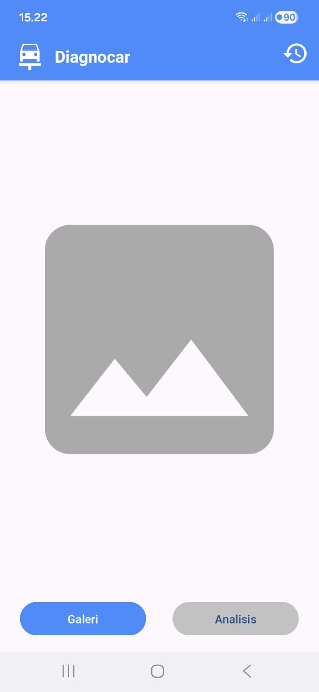
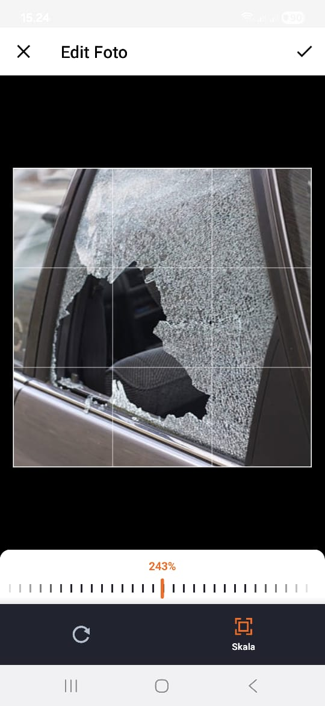
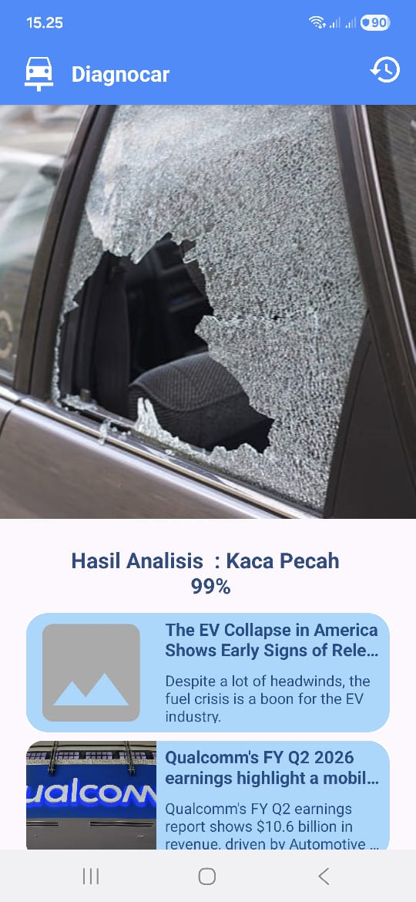
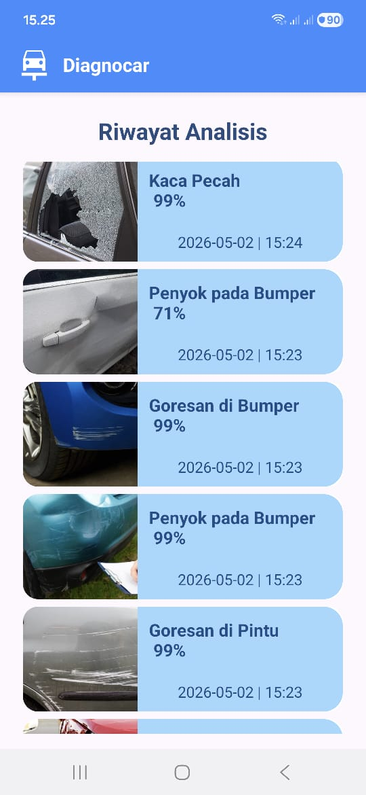

# 🚗 Diagnocar

Diagnocar is a native Android application developed as a university group assignment to demonstrate practical Machine Learning implementation. This repository showcases the integration of a deep learning model (developed by a collaborator) directly into an Android environment using on-device machine learning with TensorFlow Lite.

The application performs car damage image classification by processing user-uploaded images and predicting the specific type of damage completely offline.

> **Note:** This project is intended for educational, academic, and portfolio purposes.

---

## 📸 App Preview

| Splash Screen | Main Menu | Image Cropping | Classification | History |
|:---:|:---:|:---:|:---:|:---:|
|  |  |  |  |  |

---

## ✨ Features

* **On-Device ML Inference:** Car damage image classification powered by TensorFlow Lite without relying on external servers.
* **Manual Image Cropping:** Allows users to focus on specific damaged areas before inference for better accuracy.
* **Real-time Results:** Immediate classification results displayed intuitively on-screen.
* **Local Data Persistence:** Classification history is stored locally using **Room Database** for future reference.
* **News Integration:** Fetches and displays automotive-related news utilizing **NewsAPI**.

---

## 🔍 Damage Classes

The pre-trained model classifies car damage images into the following six categories:

1. Scratches on Bumper
2. Scratches on Door
3. Broken Glass
4. Damaged Headlight
5. Dented Bumper
6. Dented Door

---

## 🛠 Technology Stack

* **Language:** Kotlin
* **UI:** XML (Android Views)
* **Machine Learning:** TensorFlow Lite
* **Local Database:** Room Database
* **API Integration:** Retrofit & NewsAPI (Automotive news)
* **Model Architecture:** EfficientNetV2-S

> **Developer Note:** The EfficientNetV2-S TensorFlow Lite model was trained and provided by a collaborator. The primary focus of this repository is the **Android native implementation, UI/UX, and end-to-end integration**, rather than model training.

---

## 📱 How It Works (Application Flow)

1. **Upload:** The user selects or captures a car image from their device.
2. **Crop:** The user manually crops the image to isolate the damaged area.
3. **Analyze:** The application processes the cropped image through the local TFLite model.
4. **Display:** The predicted damage class is shown on the screen.
5. **Save:** The result and corresponding timestamp are securely saved to the local Room Database history.

---

## 🚀 Installation & Setup

**For Regular Users:**
1. Download the provided `.apk` file from the [Releases](https://github.com/amaradism/diagnocar/releases/latest) section.
2. Install it on an Android device (ensure "Allow from this source" is enabled in settings if required).
3. Launch the Diagnocar application.

**For Developers:**
1. Clone this repository: `git clone https://github.com/amaradism/diagnocar.git`
2. Open the project in **Android Studio**.
3. Add your [NewsAPI](https://newsapi.org/) key to your `local.properties` like this: `NEWSAPI_KEY="your_api_key_here"`
4. Build and run the project on an emulator or physical device.

---

## 🎓 Research Publication

This project's image classification approach is officially associated with a **published academic journal article**. 

> 📄 **Read the publication:** [https://doi.org/10.51876/simtek.v10i1.1547](https://doi.org/10.51876/simtek.v10i1.1547)

---

## ⚠️ Project Scope & Disclaimer

This application **does not aim to replace professional mechanic inspections**. In many real-world scenarios, car damage can be easily identified visually without technological assistance.

The primary purpose of this software is to serve as a technical showcase of:
* Native Android development proficiency.
* Seamless TensorFlow Lite mobile integration.
* Local data persistence architectures.
* Third-party API consumption.

---

## 📄 License

This project is licensed under the **MIT License** - see the [LICENSE](LICENSE) file for details.

---

## 🤝 Credits & Acknowledgments

* [**Amar Adi Ismoyo**](https://github.com/amaradism) — Android Development, UI/UX, & API Integration.
* [**Jabir Muktabir**](https://github.com/Jabir0) — Deep Learning Model (EfficientNetV2-S).
* [**Google Material Icons**](https://fonts.google.com/icons) — UI Assets (Apache License 2.0).
